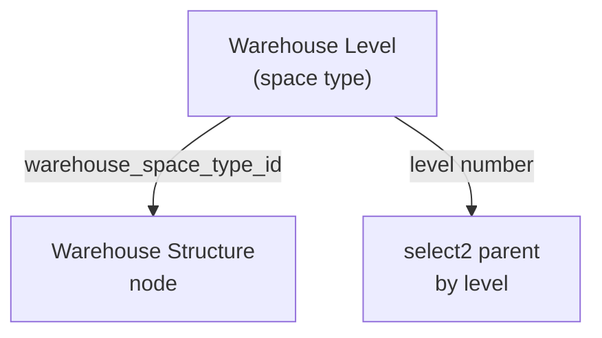

# Warehouse Level — Requirement Documentation

> **DRAFT** — Dokumen ini adalah draft awal hasil analisis codebase otomatis per 2026-06-19. Perlu direview PM/QA sebelum final.

## 0. Metadata & Changelog

| Version | Date | Author | Changes |
|---------|------|--------|---------|
| 1.0 | 2026-06-19 | QA - Yemima | Initial draft (AS-IS) |

## 1. Ringkasan Eksekutif

Master `scm_warehouse_space_types` — mendefinisikan level hierarki gudang. Controller: `WarehouseSpaceTypeController`.

## 2. How It Works

## 3. Acceptance Criteria (AS-IS)

| ID | Kriteria | Validasi | Fitur |
|----|----------|----------|-------|
| A-01 | Datalist code, name, level | index | List |
| A-02 | Create with unique level | store | Form |
| A-03 | Delete only if no warehouse | action column check | Delete guard |
| A-04 | `have_relation` on show | show | Edit form hint |
| A-05 | select2ShowReport | internal API | Report filters |

## 4. Validasi & Rules

| ID | Rule | Trigger | Pesan error |
|----|------|---------|-------------|
| V-01 | `name` required, max 50 | store/update | Laravel |
| V-02 | `level` numeric, unique on create | store | uniqueCreate on `level` |
| V-03 | `level` unique on update if `owned_by != null` | update | uniqueUpdate |
| V-04 | `description` nullable max 150 | store/update | Laravel |
| V-05 | `status`, `is_all_company`, `show_in_report` required | store/update | Cast from `true` string |

## 5. Relasi Menu

| Menu | Relasi |
|------|--------|
| Warehouse Structure | Setiap node punya `warehouse_space_type_id` |
| Warehouse Setting | Filter building level 19 |
| Warehouse Layout | Import mengacu struktur existing |

## 6. Permission

- `WarehouseSpaceTypePolicy`, menu id **201**

## 7. QA Test Notes

- [ ] Create level 20+ sesuai config warehouse
- [ ] Warehouse pakai level → delete hidden
- [ ] System-owned level: level tidak divalidasi unique di update (owned_by null)

## Related Documents

| Doc | Path |
|-----|------|
| Knowledge Base | [knowledge-base.md](./knowledge-base.md) |
| Technical | [technical.md](./technical.md) |
