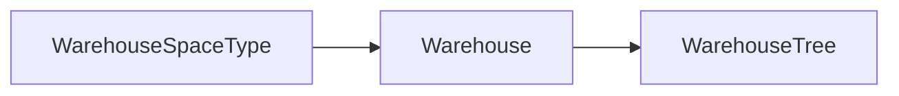

# Warehouse Level — Technical Documentation

> **DRAFT** — Dokumen ini adalah draft awal hasil analisis codebase otomatis per 2026-06-19. Perlu direview PM/QA sebelum final.

**UI route:** `/supplychain/warehouse-type`  
**API base:** `{VITE_API_URL}supplychain/warehouse-type`

---

## 1. Frontend File Map

**Root:** `olshoperp-frontend/src/pages/SCM/master/WarehouseType/`

| File | Role | Key API |
|------|------|---------|
| `DataList.vue` | Datalist + bulk delete | `GET warehouse-type` |
| `Form.vue` | Create/edit | `POST/PUT warehouse-type/{id}` |

### Router

| Route | Component |
|-------|-----------|
| `supplychain/warehouse-type` | `DataList.vue` |
| `supplychain/warehouse-type/create` | `Form.vue` |
| `supplychain/warehouse-type/edit/:id` | `Form.vue` |

---

## 2. Backend

| File | Role |
|------|------|
| `WarehouseSpaceTypeController.php` | CRUD, audit, select2ShowReport |
| `Entities/WarehouseSpaceType.php` | `scm_warehouse_space_types` |
| `Policies/WarehouseSpaceTypePolicy.php` | Policy |

---

## 3. API Routes

| Method | Path | Notes |
|--------|------|-------|
| GET | `warehouse-type` | index |
| POST | `warehouse-type` | store |
| GET | `warehouse-type/{id}` | show + `have_relation` |
| PUT/PATCH | `warehouse-type/{id}` | update |
| DELETE | `warehouse-type/{id}` | destroy (soft) |
| GET | `warehouse-type/{id}/audit` | audit |

Related: `GET warehouse/select2-warehouse-type` on `WarehouseController`.

---

## 4. Database — `scm_warehouse_space_types`

| Column | Keterangan |
|--------|------------|
| `code`, `name`, `description` | Display |
| `level` | Integer hierarchy order |
| `show_in_report` | Report visibility |
| `status`, `is_all_company` | Flags |

---

## 5. Architecture

