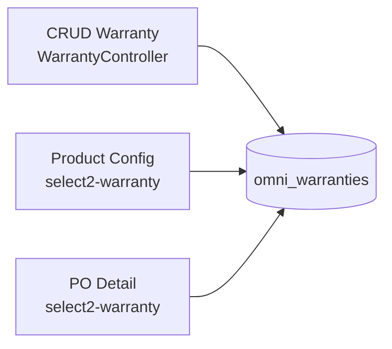
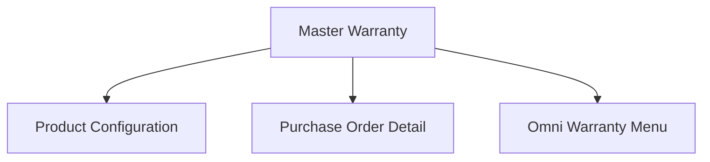

# Master Warranty — Requirement Detail

> **DRAFT** — Dokumen ini adalah draft awal hasil analisis codebase otomatis per 2026-06-19. Perlu direview PM/QA sebelum final.

**Modul:** SupplyChain (entity shared dengan OmniChannel)  
**Audience:** PM, Operations, QA, Support, Developer  
**Status:** AS-IS

---

## Daftar Isi

1. [Fungsi & Tujuan](#1-fungsi--tujuan)
2. [How It Works](#2-how-it-works)
3. [Validasi yang Berjalan](#3-validasi-yang-berjalan)
4. [Relasi Menu Lain](#4-relasi-menu-lain)
5. [FAQ](#5-faq)
6. [Known Gaps](#6-known-gaps)

---

## 1. Fungsi & Tujuan

### Apa itu Master Warranty?

Master referensi garansi produk pada tabel **`omni_warranties`**, dikelola via `WarrantyController` di modul SupplyChain.

### Masalah yang diselesaikan

| Kebutuhan | Solusi |
|-----------|--------|
| Standarisasi label garansi | Master code + name |
| Referensi produk & PO | Select2 warranty aktif |
| Shared data SCM + Omni | Entity extends OmniChannel `Warranty` |

### Entitas

| Entitas | Tabel |
|---------|-------|
| Warranty | `omni_warranties` |

---

## 2. How It Works

### Alur CRUD

1. Datalist: `GET supplychain/warranty`.
2. Create: `POST supplychain/warranty` — parse status/is_all_company.
3. Update: `PUT supplychain/warranty/{id}`.
4. Delete: soft delete via `Warranty::destroy`.
5. Audit: `GET supplychain/warranty/{id}/audit`.
6. Select2: `GET supplychain/product/select2-warranty` → `select2Warranty` (active, search code/name, limit 25).

---

## 3. Validasi yang Berjalan

### Header create/update

| Field | Rule |
|-------|------|
| `code` | Required, max 50, unique per company |
| `name` | Required, max 50, unique per company (`name` column) |
| `description` | Nullable, max 150 |
| `status` | `'true'` → 1, else 0 |
| `is_all_company` | `'true'` → 1, else 0 |

Validasi inline — **tidak ada FormRequest**.

---

## 4. Relasi Menu Lain

| Menu | Relasi |
|------|--------|
| Product General / Inventory Configuration | `select2-warranty` |
| Purchase Order | `purchase-order-detail/select2-warranty` |
| OmniChannel Warranty | Shared table |

---

## 5. FAQ

**Q: Apakah delete warranty memblokir jika dipakai produk?**  
A: AS-IS: soft delete langsung; tidak ada `relations()` check eksplisit di controller destroy (berbeda dengan Tagging).

**Q: Apakah ada approval?**  
A: Tidak.

---

## 6. Known Gaps

- `destroy` tidak set `deleted_by` (inkonsisten dengan Tagging/Location).
- Duplikat `WarrantyController` di modul OmniChannel.
- Tabel `omni_*` meski menu SCM — naming legacy.
- Tidak ada unique validation terpisah selain code/name standard.

---

## Related Documents

| Doc | Path |
|-----|------|
| Knowledge Base | [knowledge-base.md](./knowledge-base.md) |
| Technical | [technical.md](./technical.md) |
