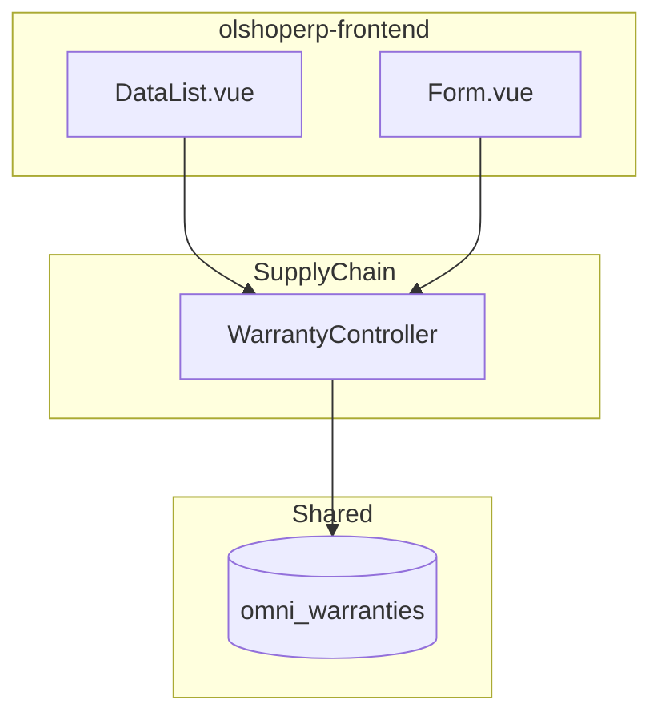

# Master Warranty — Technical Documentation

> **DRAFT** — Dokumen ini adalah draft awal hasil analisis codebase otomatis per 2026-06-19. Perlu direview PM/QA sebelum final.

**Stack:** Laravel 13 API · Vue 3 SPA  
**Menu slug:** `supplychain-warranty`  
**UI route:** `/supplychain/warranty`  
**API base:** `{VITE_API_URL}supplychain/warranty*`

---

## 1. Architecture Overview

---

## 2. Frontend File Map

**Root:** `olshoperp-frontend/src/pages/SCM/master/Warranty/`

| File | Role | Key API |
|------|------|---------|
| `DataList.vue` | Datalist | `GET supplychain/warranty` |
| `Form.vue` | Create/edit | `POST/PUT supplychain/warranty/{id}` |

| Route | Component |
|-------|-----------|
| `supplychain/warranty` | `DataList.vue` |
| `supplychain/warranty/create` | `Form.vue` |
| `supplychain/warranty/edit/:id` | `Form.vue` |

Legacy Omni pages: `src/pages/Omni/master/Warranty/` (router commented).

---

## 3. Controller

| Class | Path |
|-------|------|
| `WarrantyController` | `Modules/SupplyChain/Http/Controllers/WarrantyController.php` |

| Method | Route |
|--------|-------|
| `index` | GET `/warranty` |
| `store` | POST `/warranty` |
| `show` | GET `/warranty/{id}` |
| `update` | PUT `/warranty/{id}` |
| `destroy` | DELETE `/warranty/{id}` |
| `audit` | GET `/warranty/{id}/audit` |
| `select2Warranty` | GET `/product/select2-warranty` |

---

## 4. Model / Entity

| Class | Table | Notes |
|-------|-------|-------|
| `Modules\SupplyChain\Entities\Warranty` | `omni_warranties` | Extends `Modules\OmniChannel\Entities\Warranty` |

**Columns:** `code`, `name`, `description`, `status`, `is_all_company` + base audit.

---

## 5. DB Tables

| Table | Purpose |
|-------|---------|
| `omni_warranties` | Master warranty (shared SCM/Omni) |

---

## 6. API Routes

| Method | URI | Controller |
|--------|-----|------------|
| GET | `warranty` | resource index |
| POST | `warranty` | store |
| GET | `warranty/{warranty}` | show |
| PUT/PATCH | `warranty/{warranty}` | update |
| DELETE | `warranty/{warranty}` | destroy |
| GET | `warranty/{warranty}/audit` | audit |
| GET | `product/select2-warranty` | select2Warranty |
| GET | `purchase-order-detail/select2-warranty` | PO select2 |
| GET | `product-general-configuration/select2-warranty` | product config |
| GET | `product-inventory-configuration/select2-warranty` | product config |

---

## 7. Policy

| Class | Abilities |
|-------|-----------|
| `WarrantyPolicy` | `viewAny`, `view`, `create`, `update`, `delete` via `MainPolicy` |

---

## Related Documents

| Doc | Path |
|-----|------|
| Knowledge Base | [knowledge-base.md](./knowledge-base.md) |
| Requirement | [requirement.md](./requirement.md) |
