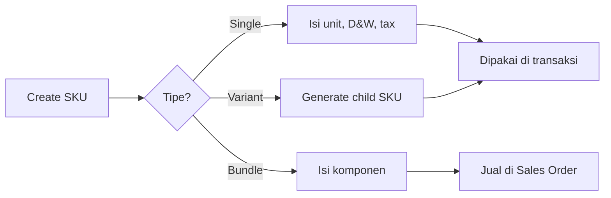

# System Product — Panduan Pengguna

**Siapa yang baca:** operator master data, admin produk, operations support  
**Menu:** Supply Chain → Master → System Product  
**Route:** `/supplychain/product`  
**Feature Map / Lingo:** [feature-map.md](./feature-map.md)

---

## 1. Apa Itu & Kenapa Penting

System Product adalah **master data SKU** internal — sumber identitas produk yang dipakai seluruh transaksi (PR, PO, inbound, outbound, Sales Order). Di sini kamu mengatur tipe produk, satuan & dimensi, variant, bundle, inventori, dan pajak. Data yang salah di sini berdampak ke stok, harga, dan sync marketplace.

---

## 2. Overview Flow & Proses Bisnis

**Versi teks:**

1. Buat SKU baru, pilih tipe (Single / Variant / Bundle).
2. Isi Unit Configuration + profil D&W per satuan.
3. Untuk Variant: generate child; untuk Bundle: isi komponen.
4. Lengkapi inventori, pajak, dan COA group.
5. SKU siap dipakai di transaksi.

🎬 [Interactive demo akan ditambahkan di sini]

### Tiga mode menu

| Mode | Route | Scope |
|------|-------|-------|
| **System Product (full)** | `/supplychain/product` | Semua section + Import/Export |
| **Product General Configuration** | `/supplychain/product-general-configuration` | Basic, unit, D&W, variant, bundle, sales, tax |
| **Product Inventory Configuration** | `/supplychain/product-inventory-configuration` | Expired, serial, batch, min-max gudang |

---

## 3. Sebelum Mulai

- [ ] Sales Category dan Product COA Group sudah tersedia.
- [ ] Master Unit & Dimension & Weight Label sudah disiapkan.
- [ ] Tentukan tipe produk (Single / Variant / Bundle) sebelum create.
- [ ] Untuk import massal: gunakan menu System Product **full**.

🎬 [Interactive demo akan ditambahkan di sini]

---

## 4. Setelah Selesai

Setelah SKU tersimpan:

1. SKU muncul di datalist dengan angka [Availability / On Hand / ATS](#sf-lingo:SF-SP-05).
2. Single/Child bisa dipilih di PR/PO/inbound/outbound.
3. Bundle bisa dijual di Sales Order (stok dipotong per komponen).
4. Platform Default D&W dipakai saat sync marketplace.

---

## 5. Yang Perlu Diperhatikan

- Kalau parent variant tidak muncul di PO/SO, itu normal—pilih **child**.
- Kalau bundle tidak bisa activate, resep invalid (1 item qty 1); tambah item atau naikkan qty ≥2.
- Kalau tidak bisa inactive, pastikan Availability & ATS = 0 di semua gudang.
- Kalau primary unit terkunci, SKU sudah dipakai transaksi—buat SKU baru bila perlu ganti satuan.
- Kalau dimensi salah di marketplace, cek **Platform Default** D&W.
- Kalau video gagal upload, gunakan format **mp4** (BE terima mp4/mov).
- Kalau section Accounting & Tax hilang, itu karena bundle aktif—pajak per komponen.
- Kalau SKU duplicate saat create, cek Data Owner (scope create masih global — GAP-SP-01).

---

## 6. Langkah-Langkah

### Langkah 1 — Basic Information

1. Isi SKU, Nama, Sales Category, Product COA Group, Condition.
2. SKU wajib unik; hindari segment `random`.

### Langkah 2 — Unit & D&W

1. Atur [Unit Configuration & D&W per unit](#sf-lingo:SF-SP-02).
2. Tambah alternate unit + konversi bila perlu.
3. Set **Platform Default** dan **Trx Default** (global) di profil yang benar.

### Langkah 3 — Tipe khusus (opsional)

1. [Variant](#sf-lingo:SF-SP-03): Enable Variations → maks 3 tipe → generate child.
2. [Bundle](#sf-lingo:SF-SP-04): Set as Product Bundle → isi komponen (≥2 item atau 1 item qty≥2).

### Langkah 4 — Inventori, pajak, simpan

1. Isi flag inventori (expired/serial/batch, min-max) bila relevan.
2. Cek Accounting & Tax (hidden bila bundle).
3. Simpan; verifikasi di datalist.

🎬 [Interactive demo akan ditambahkan di sini]

---

## 7. Tips & Hal yang Sering Bikin Bingung

- **Bundle vs BOM:** Bundle = paket jual di SO; BOM = resep produksi di [Bill of Material](../bill-of-material/).
- **D&W di mana:** di **Unit Configuration** (per satuan), bukan Shipping lagi.
- **Platform/Trx Default global:** pilih di satu unit otomatis lepas di unit lain.
- **Stok bundle:** ikut komponen paling sedikit.
- **Import massal:** hanya di menu full — kebanyakan tipe max 5000 baris; **Import Product Images** max **1000**.
- **Import Product Images:** isi **SKU Code** + link **Google Drive publik**; hanya mengganti foto **default**; SKU duplikat di file akan gagal (SKU unik tetap masuk).
- **Inactive:** hanya saat stok 0 semua gudang.

---

## 8. Referensi

| Dokumen | Isi |
|---------|-----|
| [feature-map.md](./feature-map.md) | Indeks sub-feature + Lingo |
| [knowledge-base.md](./knowledge-base.md) | SOP operator & troubleshooting |
| [requirement.md](./requirement.md) | Aturan E2E, validasi & gap |
| [technical.md](./technical.md) | API, model, stok, import |
| [Bill of Material](../bill-of-material/) | Header BOM Assembly |
| [Random SKU](../random-sku/) | Virtual SKU `-random` |

---

*Derivatif dari requirement / knowledge-base / technical v2.2.*
